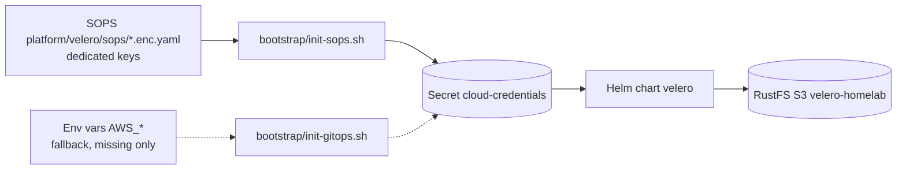

# Velero + RustFS — Backup & Restore

> **Stack:** Velero `1.18.1` (chart `12.1.0` via `vmware-tanzu/velero`) → RustFS S3 `velero-homelab` (`https://rustfs.lonk-mirfak.ts.net`) · **Namespace:** `velero` · **Wave:** `0` · **Status:** ✅ Deployed (not planned — see [README Tech Stack](../README.md#🛠-tech-stack))
>
> Loki also uses S3 but on a **different backend** — Loki → SeaweedFS (`seaweedfs-s3.seaweedfs:8333`, buckets `loki-chunks`/`loki-ruler`), Velero → RustFS (`rustfs.lonk-mirfak.ts.net`, bucket `velero-homelab`). Both are S3-compatible, but they are separate stores.

## 1. Why a bootstrap Secret

Velero backs up cluster manifests and workload data — but explicitly NOT Vault (see 9). If Velero's S3 credentials came from Vault via ExternalSecrets, a bare-metal restore deadlocks. The fix (ADR-004 option A) is a plain Secret created before ArgoCD syncs, referenced via `credentials.existingSecret: cloud-credentials`.

## 2. Flow



| Wave | Apps | Notes |
|------|------|-------|
| `-1` | `ts-operator` | Must be Healthy first — provides MagicDNS (`DNSConfig ts-dns` + `ts.net:53` CoreDNS stub reconciler, wave `-1` gate) |
| `0` | `velero`, `longhorn` | Storage ready before Vault; bucket-init resolves via in-cluster `s3-egress` Service + runtime hosts pin, server/manager pods via the `ts.net:53` stub |
| `1` | `vault` | Depends on Longhorn PVCs |

Long-lived consumers resolve `rustfs.lonk-mirfak.ts.net` through the cluster DNS `ts.net:53` stub (forwarded at runtime to `DNSConfig/status.nameserver.ip`, reconciled by the `coredns-tsnet-patch` Job + CronJob in `platform/ts-operator`). The bucket-init Job additionally keeps traffic provably in-cluster by resolving `s3-egress.tailscale.svc.cluster.local` via kube-dns and pinning the FQDN to those svc IPs in `/etc/hosts` at runtime.

## 3. Bucket creation

Automated via `templates/job-bucket-init.yaml` — an ArgoCD `Sync` hook (wave `0`) that runs after `ts-operator` is Healthy:

- Resolves `rustfs.lonk-mirfak.ts.net` via CoreDNS (120s wait), mounts `cloud-credentials`, and runs `aws s3api create-bucket` / `head-bucket` idempotently.
- Uses `amazon/aws-cli:2.37.4`, `dnsPolicy: ClusterFirst`, `AWS_S3_ADDRESSING_STYLE=path`.

Fallback manual:

```bash
aws s3api create-bucket --bucket velero-homelab --endpoint-url https://rustfs.lonk-mirfak.ts.net --region us-east-1
```

## 4. Secrets

Primary source is SOPS: `platform/velero/sops/cloud-credentials.enc.yaml` (dedicated
RustFS keys, see [RustFS IAM](./rustfs-iam.md)), applied by `bootstrap/init-sops.sh`.

Fallback in `ensureVeleroCredentials()` (only when the Secret is missing):

1. `AWS_ACCESS_KEY_ID` / `AWS_SECRET_ACCESS_KEY` (shared with Terraform)

```bash
AWS_ACCESS_KEY_ID=... AWS_SECRET_ACCESS_KEY=... ./bootstrap/init-gitops.sh prod
kubectl -n velero get secret cloud-credentials -o jsonpath='{.data.cloud}' | base64 -d
```

In CI, `.github/workflows/deploy.yaml` already injects `AWS_*` for the fallback path.

## 4b. Endpoint source (Git, no CI vars)

The S3 endpoint FQDN is a literal in git — `gitops/values.yaml` (`sharedS3.tailnetFqdn`, same in `gitops/values-dev.yaml`). It flows `gitops/values.yaml` → ArgoCD `helm.parameters` → `s3.tailnetFqdn` in BOTH the velero chart (`gitops/templates/platform/00-velero.yaml`: BackupStorageLocation, bucket-init Job, network policies) AND the ts-operator chart (`gitops/templates/platform/-1-ts-operator.yaml`: shared Service `s3-egress` in the `tailscale` namespace, `platform/ts-operator/templates/service-s3-egress.yaml`). Both platform charts carry no fallback literal: `s3.tailnetFqdn` is `""` + `required`, so a missing value fails the sync loudly instead of pointing at a dead RustFS. There is intentionally no `velero/s3-endpoint` ConfigMap and no CI-vars path — if the RustFS host changes, update the git literal (and, independently, the Terraform-state `S3_ENDPOINT` CI var, which points at the same host).

## 5. Verification

```bash
kubectl get applications -n argocd | grep -E 'velero|vault|longhorn'
kubectl -n velero get backupstoragelocations -o yaml  # phase: Ready
kubectl -n velero get pods -l app.kubernetes.io/name=velero
velero backup create manual-$(date +%Y%m%d%H%M) --wait && velero backup get
kubectl -n velero get schedules -o yaml
```

Schedules: `daily-full` (02:00, all namespaces except Vault/control-plane, 30d TTL). The former `vault-hourly` Velero schedule is retired (disabled) — hourly Vault protection is now a Longhorn local snapshot RecurringJob (see §9).

## 6. Restore runbook

Adapted from [Red Hat's OADP + OpenShift GitOps disaster-recovery guide](https://www.redhat.com/en/blog/oadp-openshift-gitops-an-approach-to-implementing-application-disaster-recovery) to this repo's layer split.

**The load-bearing rule: ArgoCD is reinstalled, never restored.**

That guide's restore procedure step 1 is *"Setup: Install the OpenShift GitOps Operator"* — the GitOps control plane comes up from its own source and ArgoCD drives everything after it. `daily-full` excludes both `argocd` and `kube-system` (Cilium) for the same reason, and the decision is recorded at `platform/velero/values.yaml:120-125`. Restoring ArgoCD from Velero would fight the root app-of-apps with stale `Application` CRs and gain nothing: every `Application` already lives in Git under `gitops/templates/`.

| Layer | Restored by | Mechanism |
|---|---|---|
| Cilium, ArgoCD | Reinstall from `infra-talos-homelab` | Never Velero |
| Workload manifests | ArgoCD auto-sync from Git | Never Velero |
| PVC/PV + file data | **Velero** | `velero restore create` |
| Postgres (CNPG) | **Barman** PITR | `recovery:` stanza, not Velero |
| Vault | Re-bootstrap | Never Velero (see §9) |

### 6.1 In-place vs cross-cluster

The guide's `isSameCluster` flag is the most consequential decision up front — it changes what you must freeze and what you must not.

| | In-place (lost PVCs, data corruption) | Cross-cluster (bare metal, or Talos → k3s) |
|---|---|---|
| Cilium / ArgoCD | Untouched | Reinstall first, then this runbook |
| Longhorn | Must already exist and be Healthy | Install, then `job-auto-restore` |
| ArgoCD freeze | **Required** (§6.3) | Required if data lands before the app-of-apps reaches those waves |
| `--existing-resource-policy` | `update` | `update` — GitOps already recreated the objects |

### 6.2 Step 1 — platform and GitOps first

Velero is installed *by* GitOps, so GitOps must be healthy before any restore can be issued. Do not hand-install Velero.

```bash
./bootstrap/init-gitops.sh prod
```

This creates the three pre-Vault Secrets (`tailscale/operator-oauth`, `velero/cloud-credentials`, `longhorn-system/longhorn-backup-secret`) and then runs `helm upgrade --install gitops`. Wait for the waves to settle:

```bash
kubectl -n argocd get applications            # wave -1 Healthy, then wave 0 (velero)
kubectl -n velero get backupstoragelocation default -o jsonpath='{.status.phase}'   # Ready
```

### 6.3 Step 2 — freeze GitOps

Every `Application` in this repo runs `automated: {prune: true, selfHeal: true}`. Left enabled, `selfHeal` reverts whatever the restore writes and `prune` deletes objects it does not recognise. The retired Vault-specific runbook did this for `vault` alone; a Velero restore needs it for every app in the restore set.

```bash
for app in seaweedfs monitoring immich; do
  kubectl -n argocd patch application "$app" --type merge \
    -p '{"spec":{"syncPolicy":{"automated":null}}}'
done
```

Confirm no `SyncPolicy` remains before continuing — a single missed Application silently reverts the restore.

### 6.4 Step 3 — restore-only mode

Without this, Velero may create or garbage-collect backups while you restore, against a 720h TTL. Both the Velero docs and the Red Hat guide (`global.inRestoreMode: true`) require it.

```bash
kubectl -n velero patch backupstoragelocation default --type merge \
  -p '{"spec":{"accessMode":"ReadOnly"}}'
```

Revert in §6.8. The chart-level equivalent is `configuration.restoreOnlyMode`, currently `false` at `platform/velero/values.yaml:69`.

### 6.5 Step 4 — pick the backup and stage the volume artifacts

```bash
velero backup get
velero backup describe daily-full-<timestamp>
```

`defaultVolumesToFsBackup: true` means per-volume `PodVolumeBackup` objects live in RustFS as `<backup-name>-podvolumebackups.json.gz`. They carry the filesystem contents the node-agent writes back, and they are **not** re-derived from the restored cluster. This is the guide's `prepare-pvb.sh` step; skipping it produces a restore that reports `Completed` with empty volumes.

```bash
aws s3 cp "s3://velero-homelab/velero/backups/<backup-name>/<backup-name>-podvolumebackups.json.gz" . \
  --endpoint-url https://rustfs.lonk-mirfak.ts.net
gunzip -f <backup-name>-podvolumebackups.json.gz
kubectl apply -f <backup-name>-podvolumebackups.json
```

### 6.6 Step 5 — the restore

```bash
velero restore create dr-$(date +%Y%m%d%H%M) \
  --from-backup daily-full-<timestamp> \
  --include-namespaces seaweedfs,monitoring,immich \
  --exclude-resources pods \
  --existing-resource-policy update \
  --wait
```

Three flags carry the weight:

- `--exclude-resources pods` — `daily-full` includes `pods` so the node-agent can discover volumes (`platform/velero/values.yaml:127-136`), but that also makes Velero try to recreate workloads, which is ArgoCD's job. Excluding them *at restore time* splits the layers cleanly: Velero writes data, ArgoCD writes workloads. This is the fix for the ArgoCD/Velero collision, and it is the step most third-party recipes omit.
- `--existing-resource-policy update` — the default policy is `none`, which skips objects GitOps already recreated and leaves stale data behind.
- `--include-namespaces` — explicit, because `daily-full` covers `*` but `argocd`, `vault` and `longhorn-system` must stay out (see the layer table).

### 6.7 Step 6 — databases are not in this restore

Velero's FsBackup of a live Postgres is crash-consistent, not a valid recovery path. `immich-database` and `grafana-database` restore through Barman; `charts/cnpg/templates/_cluster.tpl` currently renders only `bootstrap.initdb`, with no `recovery:` stanza in the repo, so PITR remains a manual step until that is added.

Postgres volumes use StorageClass `longhorn-cnpg` (`recurringJobGroup: no-snapshot`), so they are excluded from every Longhorn RecurringJob by design — Barman is the authoritative copy.

### 6.8 Step 7 — rebind Longhorn, then unfreeze

`platform/longhorn/templates/job-auto-restore.yaml` recreates Longhorn `Volume` CRs from the last `backup=daily` Completed backup, but its own header (`:25-27`) scopes it to Volume CRs only: PV/PVC rebind is a documented phase-2 manual step and restored volumes come back `Detached`. Rebind, then release GitOps:

```bash
for app in seaweedfs monitoring immich; do
  kubectl -n argocd patch application "$app" --type merge \
    -p '{"spec":{"syncPolicy":{"automated":{"prune":true,"selfHeal":true}}}}'
done
kubectl -n velero patch backupstoragelocation default --type merge \
  -p '{"spec":{"accessMode":"ReadWrite"}}'
```

### 6.9 Step 8 — validate

```bash
velero restore get
velero restore describe dr-<timestamp>
velero restore logs dr-<timestamp> | grep 'level=error'
kubectl -n argocd get applications     # back to Synced / Healthy
kubectl get pvc -A                     # Bound, not Detached
```

### 6.10 Restore troubleshooting

| Symptom | Fix |
|---|---|
| Restore `PartiallyFailed` | `velero restore describe <name>`; pre-existing objects are skipped unless `--existing-resource-policy update` was set |
| Restore completes, volumes empty | `PodVolumeBackup` artifacts were not staged (§6.5) |
| ArgoCD reverts restored objects | An `Application` was not frozen (§6.3) — `selfHeal: true` is on by default |
| Workloads do not come back | Expected — ArgoCD owns them; check `kubectl -n argocd get applications` |
| `BSL not Ready` after unfreeze | The `ReadOnly` patch in §6.4 was not reverted |
| Postgres restored but inconsistent | Use Barman, not Velero (§6.7) |
| `NoSuchBucket` or `velero` unreachable | RustFS is itself gone — see [RustFS IAM](./rustfs-iam.md) |

## 7. Troubleshooting

| Symptom | Fix |
|---------|-----|
| `cloud-credentials not found` | Re-run bootstrap with env vars |
| `NoSuchBucket` | Check `kubectl -n velero logs job/velero-bucket-init` |
| `BSL not Ready` | Verify `s3Url`/`s3ForcePathStyle` and ini format |
| `nslookup` fails | Check the `ts.net:53` stub (`kubectl -n kube-system get cm coredns -o yaml`), `DNSConfig ts-dns` status IP, then the `s3-egress` Service endpoints and the bucket-init `/etc/hosts` pin |
| Velero OOMKilled | `resources.limits.memory` is pinned at `512Mi` (chart default `128Mi` OOMs on FsBackup); `deployNodeAgent: true` is required for `defaultVolumesToFsBackup: true` |

## 8. References

- ADR-004 option A, ADR-011 (DNS/NetworkPolicy), ADR-009 (Vault DR vs Velero backup)
- Restore procedure: §6, derived from [Red Hat — OADP + OpenShift GitOps DR](https://www.redhat.com/en/blog/oadp-openshift-gitops-an-approach-to-implementing-application-disaster-recovery) and the [Velero disaster-recovery docs](https://velero.io/docs/main/disaster-case)
- Chart: `platform/velero/Chart.yaml` (vmware-tanzu/velero `12.2.0`, app `1.18.1`, `deployNodeAgent: true`, memory limit `512Mi`) + `platform/velero/values.yaml` (schedule `daily-full` with `vault`/`argocd` excluded, RustFS `s3Url`/`s3ForcePathStyle`)
- BSL: single default location on RustFS (`s3://velero-homelab/velero/`, `s3ForcePathStyle: true`, `insecureSkipTLSVerify: true` for cluster-internal TLS)
- App: `gitops/templates/platform/00-velero.yaml` (sync-wave `0`, `wave-policy: healthy`, `CreateNamespace=true`)
- AWS plugin: `velero/velero-plugin-for-aws:v1.14.3` (digest-pinned)

## 9. Vault policy — excluded from Velero, re-bootstrap + rotation

Nothing of Vault is stored in Velero. `daily-full` lists `vault` in `excludedNamespaces`, and the old `vault-hourly` schedule is `disabled: true` (retained in `values.yaml` as documentation only).

Rationale: restoring Vault Raft state from a Velero backup corrupts the cluster (stale quorum/peers, sealed-state mismatch). Vault holds no irreplaceable PKI/transit material — everything it stores is regenerable — so DR is re-bootstrap, not restore:

```bash
./platform/vault/scripts/bootstrap-vault.sh   # init if initialized==false, unseal, kv-v2 + k8s auth
# then rotate secrets (ESO ClusterSecretStores re-sync from Vault)
```

Hourly crash-consistency for Vault volumes comes from Longhorn, not Velero: `platform/longhorn/templates/recurringjobs.yaml` defines a `RecurringJob` (`longhorn.io/v1beta2`, Longhorn chart `1.12.1` has no native `recurringJobs` values support, hence the raw CR):

| RecurringJob | Cron | Task | Retain | Group |
|--------------|------|------|--------|-------|
| `vault-hourly-snapshot` | `0 * * * *` | `snapshot` (local, NOT `backup`) | 24 (~1 day) | `vault-hourly` |

- `snapshot` vs `backup`: snapshots are local copy-on-write (instant, no target needed); `backup` requires an S3/NFS backup target, which is intentionally unconfigured in the Longhorn UI for now.
- Opt-in: label Vault volumes with `recurring-job-group.longhorn.io/vault-hourly=enabled` (Longhorn matches jobs to volumes by group). Commented-out daily snapshot templates for `seaweedfs`/`monitoring` are included in the same file for future use.
- Vault DR: see [ADR-009](adrs/009-vault-dr-and-velero-backup.md) §Decision 1 for the golden rule (Raft snapshots are operational only — never the DR path). Its dedicated runbook was deleted on 2026-09-28; the cluster restore path is §6 above.
